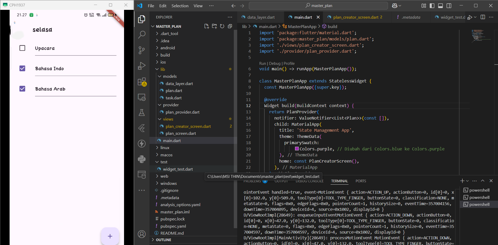
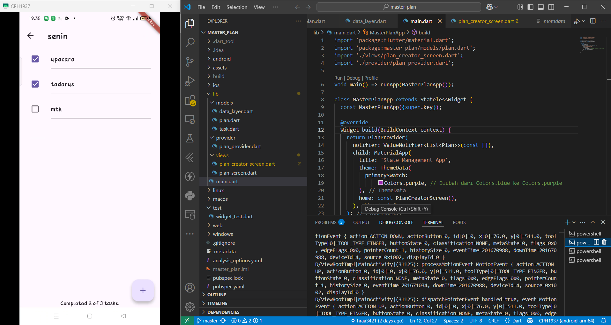
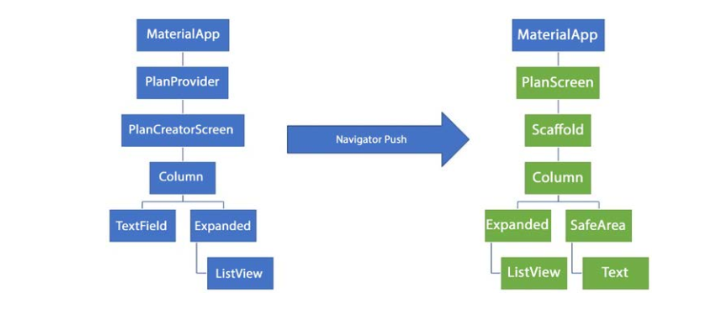
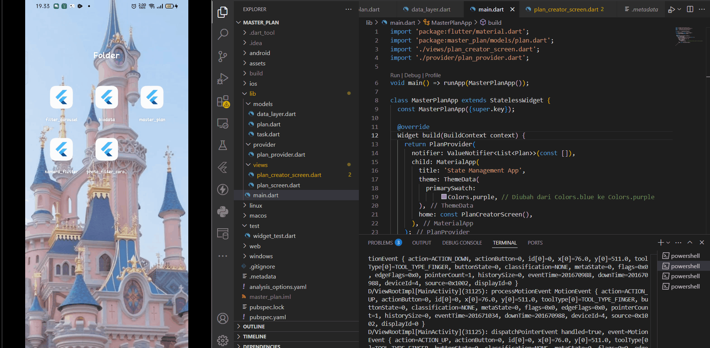

# Tugas Praktikum 1: Dasar State dengan Model-View

## 1. Hasil Praktikum 1
Pada praktikum ini, kami membuat sebuah aplikasi berbasis mobile untuk menyimpan daftar _To-Do List_.  
Kami menggunakan Flutter sebagai platform pengembangan. Aplikasi ini dapat digunakan oleh berbagai kalangan usia.  
# 

## 2. Jelaskan maksud dari langkah 4 pada praktikum tersebut! Mengapa dilakukan demikian
Langkah 4: Membuat file data_layer.dart

Penjelasan :
File data_layer.dart dibuat sebagai barrel file yang mengelompokkan beberapa model (plan.dart dan task.dart) agar lebih mudah diimpor.
export 'plan.dart';
export 'task.dart';

Tujuan :
1. Menyederhanakan Impor: Mengimpor satu file (data_layer.dart) daripada mengimpor setiap file model secara terpisah.
2. Mengelompokkan file terkait dalam satu entry point.
3. Mencegah kesalahan impor yang berulang.
   
## 3. Mengapa perlu variabel plan di langkah 6 pada praktikum tersebut? Mengapa dibuat konstanta ? 
## Langkah 6: Membuat plan_screen.dart

### Mengapa perlu variabel `plan`?
Variabel plan digunakan untuk menyimpan objek dari kelas Plan yang berisi daftar tugas. Ini memungkinkan pengelolaan tugas seperti menambah, menghapus, atau mengedit melalui antarmuka pengguna.

### Mengapa dibuat konstanta (`const`)?
1. Dibuat pada waktu kompilasi, lebih efisien.
2. Mencegah Perubahan Tidak Sengaja: Data `Plan` tetap (_immutable_).
3. Menghindari bug akibat modifikasi yang tidak diinginkan.

## 5. Apa kegunaan method pada Langkah 11 dan 13 dalam lifecyle state ?
## Langkah 11 & 13 : Scroll Listener & Dispose Method

### Kegunaan Method pada Lifecycle State

#### Langkah 11: `initState()`
- **Tujuan: Menginisialisasi `scrollController` dan menambahkan _listener_ untuk mendeteksi aktivitas scroll.
- **Fungsi: Menyembunyikan keyboard saat pengguna menggulir layar dengan menghapus fokus dari input aktif (`FocusNode()`).
- **Lifecycle: Dipanggil sekali saat widget pertama kali dibuat.

#### Langkah 13: `dispose()`
- **Tujuan: Membersihkan `scrollController` saat widget tidak lagi digunakan.
- **Fungsi: Mencegah kebocoran memori (_memory leak_) dengan memanggil `dispose()` pada `scrollController`.
- **Lifecycle: Dipanggil sekali saat widget dihapus dari pohon widget (_widget tree_).

# Tugas Praktikum 2: InheritedWidget
## 1. Hasil Praktikum 
Pada Praktium ini, kita akan memperbarui kode dari aplikasi Master Plan dengan memisahkan data todo list ke luar class view-nya
# 

## 2. Jelaskan mana yang dimaksud InheritedWidget pada langkah 1 tersebut! Mengapa yang digunakan InheritedNotifier?

### Jawaban:
### Apa itu InheritedWidget?
`InheritedWidget` adalah widget khusus yang memungkinkan widget turunan mengakses data dari widget induk tanpa perlu mengoper data
secara eksplisit melalui konstruktor. Biasanya digunakan untuk membuat State Management yang efisien.

### Mengapa menggunakan `InheritedNotifier`?
`InheritedNotifier` digunakan karena kita ingin menyediakan akses ke objek `Plan` yang dapat berubah (dinamis)
dan perlu memberi tahu widget turunan ketika terjadi perubahan. 

> `InheritedNotifier` cocok digunakan karena aplikasi membutuhkan notifikasi perubahan secara otomatis, bukan hanya akses data statis.

## 3. Jelaskan maksud dari method di langkah 3 pada praktikum tersebut! Mengapa dilakukan demikian?
## Langkah 3: Menambah Method pada plan.dart

### Penjelasan Method
1. **completedCount**
   - Menghitung jumlah tugas yang sudah selesai (complete).
   - Menggunakan metode .where() untuk memfilter tugas yang sudah selesai, lalu mengambil panjang daftar hasilnya (.length).

2. **completenessMessage**
   - Menghasilkan pesan ringkasan dari total tugas yang selesai dan jumlah seluruh tugas.
   - Contoh output: "3 out of 5 tasks".

### Mengapa Dilakukan?
-  Memberikan cara mudah untuk mendapatkan statistik tugas yang selesai tanpa mengulang proses filtering di tempat lain.
-  Mengurangi duplikasi kode dengan menyediakan akses langsung ke data yang sering digunakan.
-  Mempermudah pembuatan tampilan yang menampilkan progres tugas.
> Dengan menambahkan method ini, aplikasi dapat menampilkan status progres dengan lebih efisien dan rapi.

# Tugas Praktikum 3: State di Multiple Screens
## 1. Hasil Praktikum
Pada praktikum ini, kami akan menambah screen lain pada aplikasi Master Plan sehingga bisa membuat kelompok daftar plan lebih dari satu.

## 2. Berdasarkan Praktikum 3 yang telah Anda lakukan, jelaskan maksud dari gambar diagram berikut ini!
# 

## Penjelasan Diagram Navigasi Praktikum 3

### Diagram Navigasi
Diagram menunjukkan *alur navigasi antar halaman dalam aplikasi Flutter* menggunakan Navigator.push().

### Penjelasan
1. *Kiri (Halaman PlanCreatorScreen)*
   - Struktur Widget:
     - MaterialApp sebagai root aplikasi.
     - PlanProvider untuk mengelola state aplikasi.
     - PlanCreatorScreen menampilkan UI dengan:
       - Column yang memiliki TextField dan Expanded.
       - ListView berada di dalam Expanded untuk menampilkan daftar item yang dapat digulir.

2. *Navigasi (Navigator Push)*
   - Penggunaan Navigator.push() untuk **berpindah dari halaman PlanCreatorScreen ke halaman PlanScreen**.

3. *Kanan (Halaman PlanScreen)*
   - Struktur Widget:
     - MaterialApp sebagai root aplikasi.
     - PlanScreen sebagai halaman tujuan.
     - Scaffold menyediakan struktur dasar dengan AppBar dan Body.
     - Column terdiri dari:
       - Expanded berisi ListView untuk menampilkan daftar tugas.
       - SafeArea dan Text untuk menampilkan informasi tambahan atau status.

### Kesimpulan
Navigasi dilakukan dari PlanCreatorScreen ke PlanScreen menggunakan Navigator.push(). Kedua layar memiliki struktur yang berbeda namun menggunakan **state management yang sama melalui PlanProvider**.

## 3. Lakukan capture hasil dari Langkah 14 berupa GIF, kemudian jelaskan apa yang telah Anda buat!
# 

Aplikasi Master Plans berfungsi sebagai alat untuk mengelola daftar rencana (plans). Pengguna dapat menambahkan rencana baru melalui form input yang tersedia, serta melihat daftar rencana yang mencantumkan jumlah tugas beserta progres penyelesaiannya. Selain itu, aplikasi ini memungkinkan pengguna untuk mengelola tugas dalam setiap rencana, termasuk menambah.
